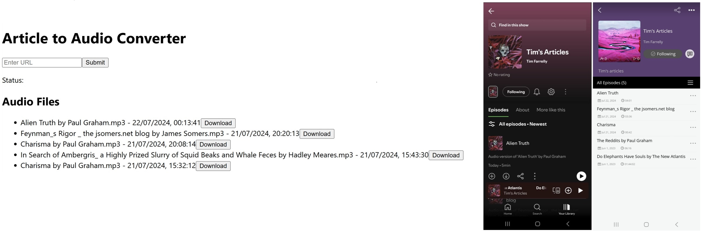

# Article2Audio

## Convert any article to audio with OpenAI's TTS API 

Article2Audio is a web app that allows users to copy the URL to an article and receive back a lovely audio version 
of the article to download locally as a mp3 file. With some configuring and setting up an RSS feed, users can also 
automatically sync these audio files to their favorite podcast app as part of a personal podcast for easy listening on 
the go.

For ease of use, we also include a simple python script which allows users to directly convert article URLs to audio 
files without needing to spin up the web app. 

It's currently **very** barebones and a work in progress, but the functionality is all there!

<p align="center">
  
  <br>
  <em><strong>Simple</strong> web app (left), synced articles available as a personal podcast on Spotify (right)</em></em>
</p>


### Sample Audio Output

[Sample Audio](https://github.com/timf34/Article2Audio/assets/66926418/bd6fb7e4-812d-455e-93df-1c12560eca13)


##  Installation: Web App 

1. **Clone the repository:**
   ```bash
   git clone https://github.com/yourusername/Article2Audio.git
   cd Article2Audio
   ```
   
2. **Create `.env` files**

   **Client `.env` file_**

   First create a `.env` file within the `/client` directory and add your localhost (or URL if you're deploying)
   to it:
   ```bash
    cd client
    echo "REACT_APP_API_URL=http://localhost:8001/api" > .env
   ```

   **Server `.env` file**

  Then create a `.env` file within the `/server` directory and add the following environment variables:
  ```bash
   cd server
   echo "OPENAI_KEY=your-openai-key" > .env
   echo "AWS_ACCESS_KEY_ID=your-aws-access-key" >> .env
   echo "AWS_SECRET_ACCESS_KEY=your-aws-secret-key" >> .env
  ```
  Note that the AWS keys are optional and for uploading to S3 for the RSS feed, 
  but the OpenAI key is required for the app to function.

      
3. **Setup Nginx** (Optional)

   If you would like to set up a proper web server with a custom domain, you can use Nginx. 
   We include `scripts/setup_nginx.sh` to help you set up Nginx on an Ubuntu server.


4. **Build and run Docker**

   This will spin up the web app:
    ```bash
    docker compose up --build
    ```

## Installation: Configure RSS feed and sync to personal podcast

Assuming that you are running the web app on a server with a domain name, you can set up an RSS feed to sync the audio
files to your favorite podcast app. We have built support for doing this using AWS S3, but you of course can switch this
out for any other cloud storage provider, just ensure that your bucket is publicly accessible.

We will assume you know how to set up an S3 bucket and make it publicly accessible, and how to get your AWS keys. I'll 
include the S3 bucket policy [here](assets/make_s3_bucket_public_policy.json) to help.

1. **Update the `/server/data/rss.xml file with your own info**
   
   Update the `/server/data/rss.xml` file with your own information (this will be obvious). This is the RSS feed that 
   will be used to sync the audio files to your podcast app.

   To ensure that this has worked, visit `www.yourdomain.com/rss.xml` and check that the file is accessible.

2. **Submit the RSS feed URL to podcast hosting services**
   
   Submit the RSS feed URL to your favorite podcast hosting service (e.g. Spotify, Apple Podcasts, etc.) and you should 
   be able to listen to your articles as a podcast!

   To do so with Spotify or Apple, you'll have to make an account. But many other podcast apps will allow you to add a
   custom RSS feed URL without needing an account, such as [PodcastAddict](https://podcastaddict.com/submit). 
   
The audio files will automatically upload to S3 once they've been generated, and should be available soon thereafter
on your podcast app of choice. 


## Installation: Simple Python Script 

We also include a simple python script that allows users to convert article URLs to audio files without needing to spin
up the web app. 

1. **Clone the repository:**
   ```bash
   git clone https://github.com/yourusername/Article2Audio.git
   cd Article2Audio
   ```

2. **Add your OpenAI api key**
   
   If you have not already, create a `.env` file in the `/server` directory and add your openAI key to it:
   ```bash
    cd server
    echo "OPENAI_KEY=your-openai-key" > .env
    ```

3. **Install the required packages:**
   ```bash
    pip install -r server/requirements.txt
    ```

### Python Script Usage

The script `convert_article_urls_to_audio.py` allows for two modes of operation:

1. **Default Mode**: By default it will use the URLs specified in the `HARDCODED_URLS` list at the top of the file.
   ```bash
   python convert_article_urls_to_audio.py
   ```
   
2. **Command Line Mode**: Overrides hardcoded URLs by specifying URLs via the command line with the --urls option.
   ```bash
   python convert_article_urls_to_audio.py --urls https://www.thefitzwilliam.com/p/james-joyce-was-a-complicated-man "https://www.honest-broker.com/p/how-picasso-turned-me-into-a-strategy"
   ```


## License 

Article2Audio is licensed under a GPL-3.0 license.